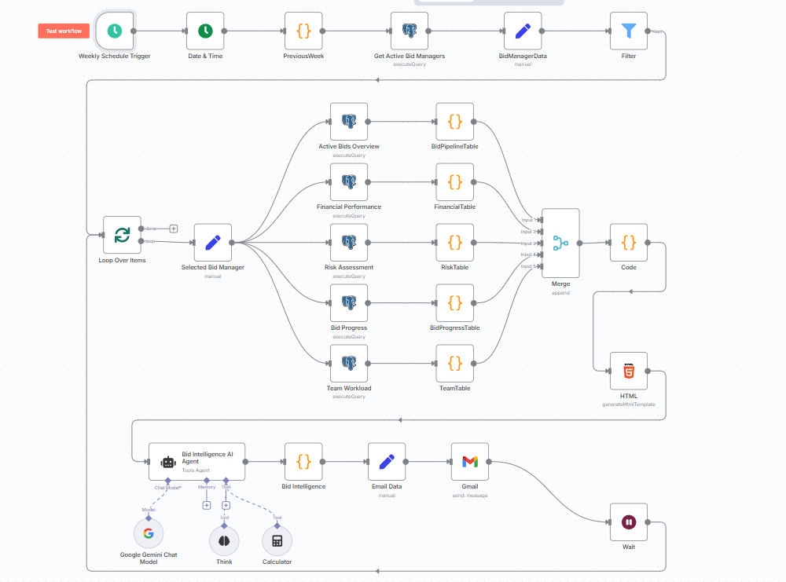
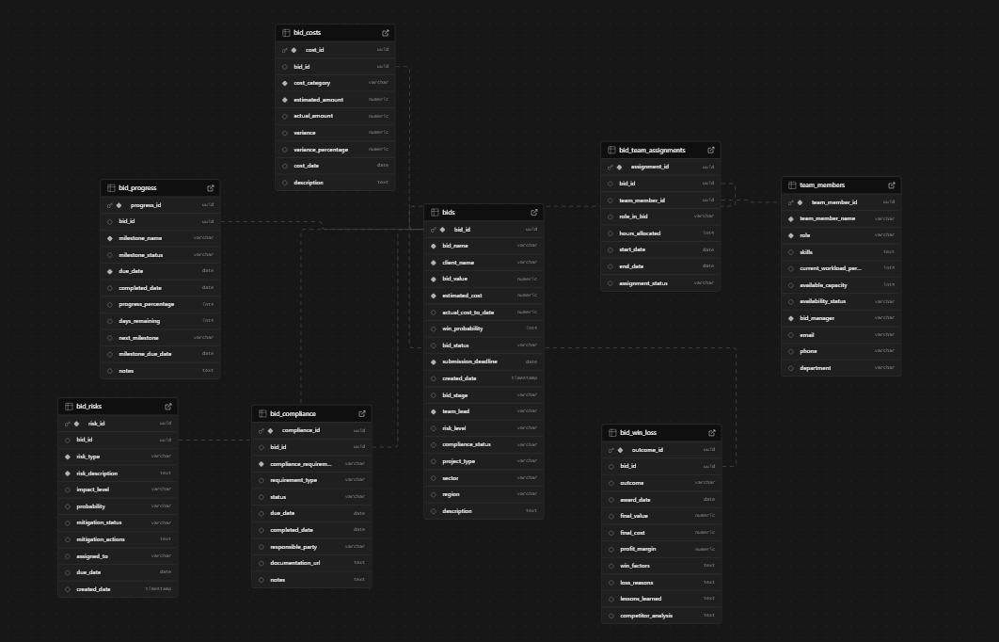
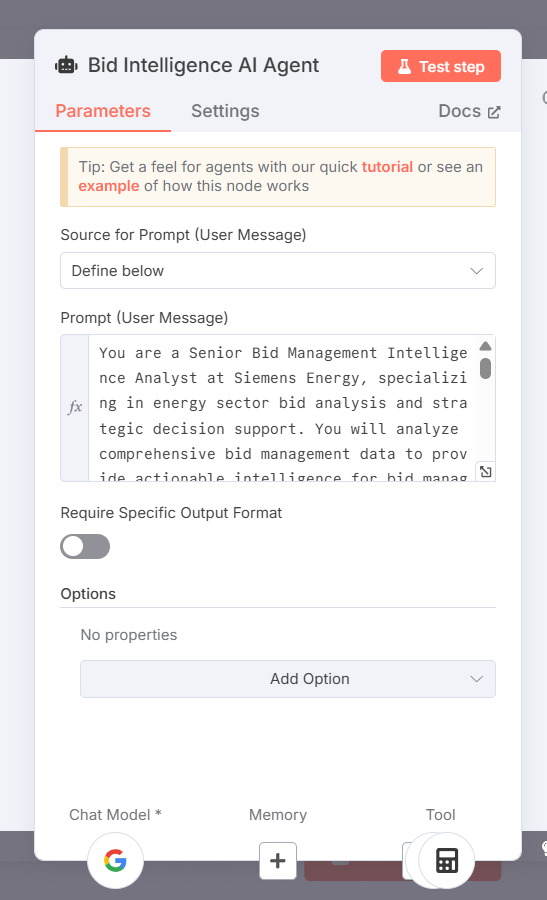
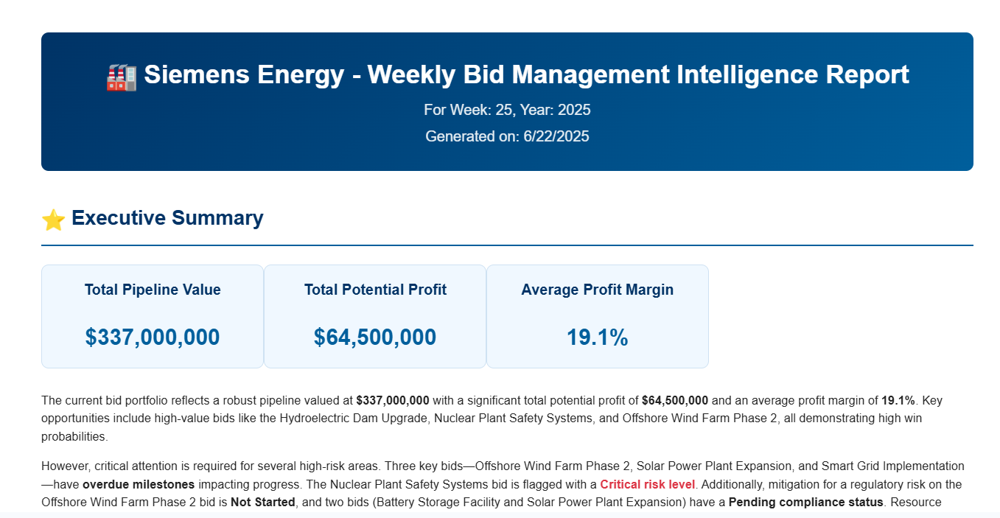
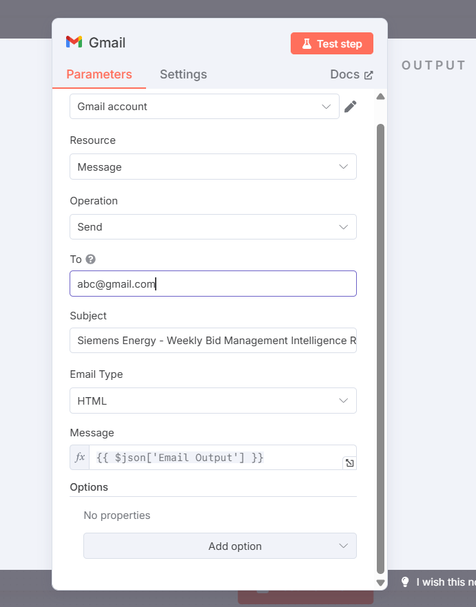

# Siemens Energy Bid Management Intelligence System

An automated business reporting system that leverages AI agents and advanced analytics to provide comprehensive bid management intelligence for Siemens Energy's energy sector operations.

## Overview

This system addresses the critical need for real-time bid management intelligence in the energy sector, where complex projects require sophisticated tracking, analysis, and reporting capabilities. The solution automates weekly reporting processes, providing actionable insights for bid managers and leadership teams.

## System Architecture

### Core Components

1. **Database Layer**: PostgreSQL database with comprehensive bid management schema
2. **Workflow Engine**: n8n automation platform for orchestration
3. **AI Intelligence**: Google Gemini AI agent for advanced analysis and report generation
4. **Email Delivery**: Automated report distribution via Gmail/Outlook
5. **Scheduling**: Weekly automated execution with configurable triggers

### Workflow Overview



*The complete n8n workflow showing data flow from database queries through AI analysis to email delivery*

### Database Schema



*Comprehensive database schema supporting bid management, progress tracking, risk assessment, and team workload management*

### Key Features

- **Multi-dimensional Analysis**: Financial, operational, risk, and team performance metrics
- **AI-Powered Insights**: Intelligent analysis of bid data with actionable recommendations
- **Professional Reporting**: Executive-level HTML reports with Siemens Energy branding
- **Real-time Data Processing**: Live database queries with automated data transformation
- **Scalable Architecture**: Modular design supporting multiple bid managers and regions

## Business Context

### Siemens Energy Bid Management Challenges

Siemens Energy operates in a highly competitive energy sector where bid management involves:

- **Complex Project Portfolios**: Managing multiple high-value energy projects simultaneously across renewable energy, grid infrastructure, nuclear, and hydroelectric sectors
- **Regulatory Compliance**: Ensuring adherence to strict energy sector regulations and safety standards
- **Resource Allocation**: Optimizing team workload and resource distribution across competing bids
- **Risk Management**: Identifying and mitigating technical, financial, and regulatory risks
- **Financial Performance**: Tracking cost variances, profit margins, and ROI across bid portfolios
- **Competitive Intelligence**: Analyzing win/loss factors and market positioning

### Why This System is Essential

The energy sector's bid management complexity requires:

1. **Real-time Intelligence**: Immediate visibility into bid pipeline health and performance metrics
2. **Predictive Analytics**: AI-powered analysis of win probabilities and risk factors
3. **Automated Reporting**: Consistent, timely delivery of executive-level intelligence reports
4. **Resource Optimization**: Data-driven insights for team capacity and workload management
5. **Compliance Tracking**: Automated monitoring of regulatory and safety requirements

## AI Agent Configuration



*The AI agent is configured with specialized prompts for energy sector bid analysis and executive reporting*

## Sample Report Output



*Example of the professional HTML report generated by the system, featuring Siemens Energy branding and executive-level insights*

## Database Schema

The system uses a comprehensive PostgreSQL schema with 8 core tables:

- **bids**: Main bid information and metadata
- **bid_progress**: Milestone tracking and deadline management
- **bid_risks**: Risk assessment and mitigation tracking
- **team_members**: Team capacity and workload management
- **bid_team_assignments**: Resource allocation and role assignments
- **bid_costs**: Detailed cost tracking and variance analysis
- **bid_win_loss**: Historical outcomes and lessons learned
- **bid_compliance**: Regulatory compliance tracking

## Installation and Setup

### Prerequisites

- n8n instance (self-hosted or cloud)
- PostgreSQL database
- Google Gemini API access
- Gmail/Outlook credentials for email delivery

### Configuration Steps

1. **Database Setup**
   ```sql
   -- Execute the database_schema.sql file
   psql -d your_database -f database_schema.sql
   ```

2. **n8n Credentials**
   - Configure PostgreSQL connection
   - Set up Google Gemini API credentials
   - Configure Gmail/Outlook email credentials

3. **Workflow Import**
   - Import the `workflow_sanitized.json` file into n8n
   - Update credential references with your actual credential IDs
   - Configure email recipients and scheduling

4. **Environment Variables**
   ```bash
   # Update these in your n8n environment
   POSTGRES_CREDENTIAL_ID=your_postgres_credential_id
   GEMINI_API_CREDENTIAL_ID=your_gemini_credential_id
   GMAIL_CREDENTIAL_ID=your_gmail_credential_id
   ```

## Workflow Overview

### Weekly Execution Process

1. **Trigger**: Weekly schedule trigger (configurable time)
2. **Data Collection**: Query active bids and related data from database
3. **AI Analysis**: Gemini AI agent analyzes data and generates insights
4. **Report Generation**: Create professional HTML report with Siemens Energy branding
5. **Email Delivery**: Send formatted report to stakeholders
6. **Loop Processing**: Process multiple bid managers sequentially

### Key Workflow Nodes

- **Weekly Schedule Trigger**: Automated weekly execution
- **Active Bids Overview**: Comprehensive bid pipeline analysis
- **Financial Performance**: Cost and profitability analysis
- **Risk Assessment**: Risk identification and mitigation tracking
- **Team Workload**: Resource allocation and capacity analysis
- **Bid Intelligence AI Agent**: AI-powered analysis and recommendations
- **Email Delivery**: Automated report distribution

## Email Configuration



*Configuration of automated email delivery with professional formatting and Siemens Energy branding*

## Report Sections

### Executive Summary
Strategic overview of bid portfolio performance with key wins, risks, and opportunities

### Pipeline Analysis
- Total pipeline value and win probability distribution
- Critical deadlines and resource allocation needs
- Strategic opportunities and competitive positioning
- Pipeline conversion rates and velocity metrics

### Financial Intelligence
- Total bid value vs estimated costs
- Profitability projections and margin analysis
- Cost variance analysis and budget performance
- ROI calculations and financial risk assessment

### Operational Performance
- Milestone completion rates and deadline adherence
- Team workload distribution and capacity utilization
- Process bottlenecks and efficiency improvements
- Quality metrics and compliance status

### Risk Intelligence
- High-risk bids requiring immediate attention
- Compliance gaps and regulatory concerns
- Resource constraints and capacity risks
- Market and competitive risk factors

### Strategic Recommendations
- Bid prioritization and resource allocation
- Risk mitigation strategies
- Process improvements and efficiency gains
- Competitive positioning and win strategy optimization

## Security Considerations

### Data Protection
- All sensitive information has been sanitized in the provided files
- Credential IDs and personal data replaced with placeholders
- Email addresses and webhook IDs removed from public files

### Implementation Security
- Use environment variables for all credentials
- Implement proper database access controls
- Configure email delivery with appropriate authentication
- Regular security audits of workflow configurations

## Customization

### Adding New Data Sources
The modular architecture supports easy integration of additional data sources:
- CRM systems for customer relationship data
- ERP systems for financial data
- Project management tools for milestone tracking

### Extending AI Analysis
The Gemini AI agent can be enhanced with:
- Custom prompts for specific analysis requirements
- Additional tools for specialized calculations
- Integration with external analytics services

### Report Customization
Reports can be customized for:
- Different stakeholder groups (executive, operational, technical)
- Regional or sector-specific requirements
- Frequency adjustments (daily, weekly, monthly)

## Monitoring and Maintenance

### Performance Monitoring
- Database query performance optimization
- Workflow execution time tracking
- Email delivery success rates
- AI response quality assessment

### Regular Maintenance
- Database index optimization
- Workflow node updates
- Credential rotation
- Report format updates

## Troubleshooting

### Common Issues
1. **Database Connection**: Verify PostgreSQL credentials and network connectivity
2. **AI API Limits**: Monitor Gemini API usage and rate limits
3. **Email Delivery**: Check email service credentials and spam filters
4. **Data Quality**: Validate database data integrity and completeness

### Support Resources
- n8n documentation and community forums
- Google Gemini API documentation
- PostgreSQL performance tuning guides
- Siemens Energy internal IT support

## Contributing

This system is designed for Siemens Energy's specific bid management requirements. For internal modifications:

1. Follow the existing code structure and naming conventions
2. Test all changes in a development environment
3. Update documentation for any new features
4. Ensure security compliance for all modifications

## License

This project is proprietary to Siemens Energy and contains confidential business logic and data structures specific to energy sector bid management operations.

## Contact

For questions about this system, contact the Siemens Energy Bid Management team or the system development team.

---

*This system represents a significant advancement in automated business intelligence for energy sector bid management, providing the real-time insights and predictive analytics needed to maintain competitive advantage in a complex and regulated industry.* 